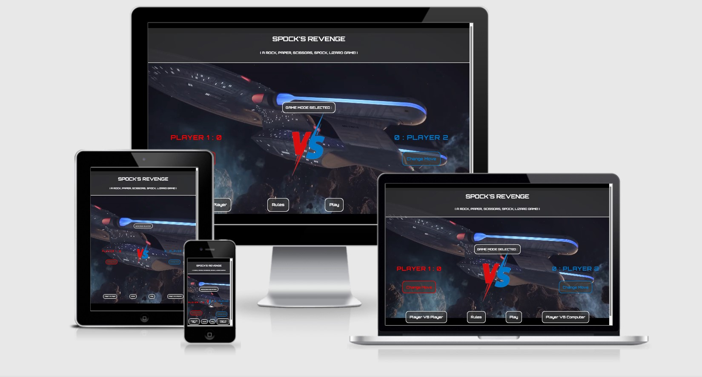
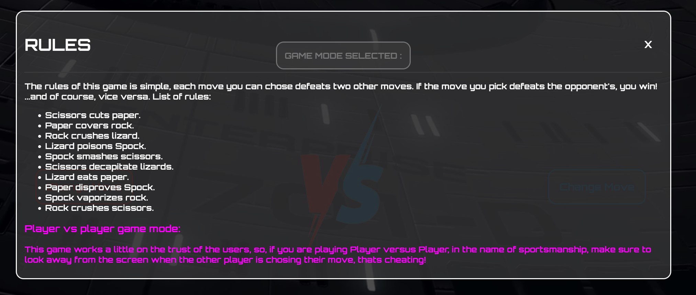
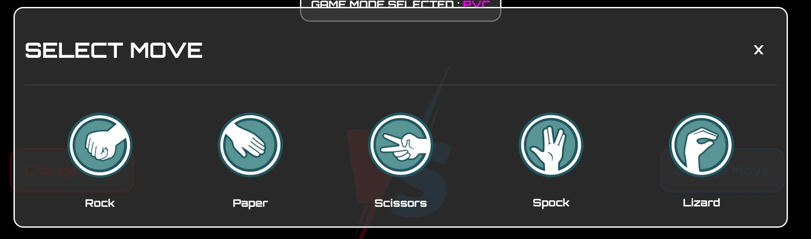
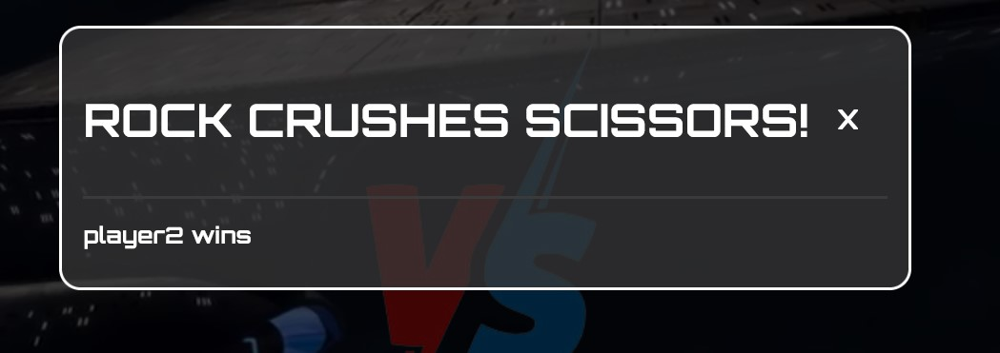
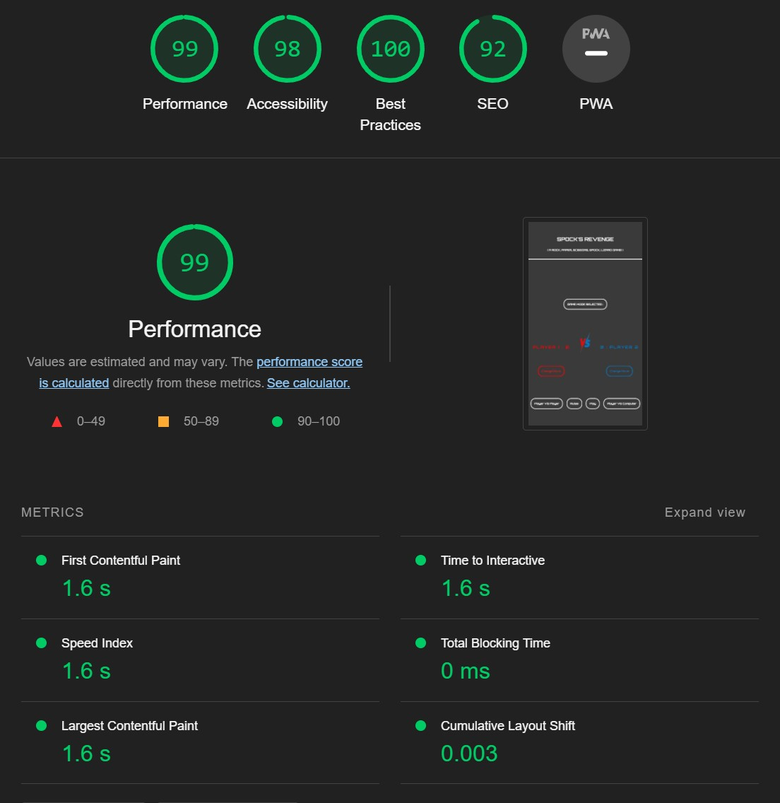
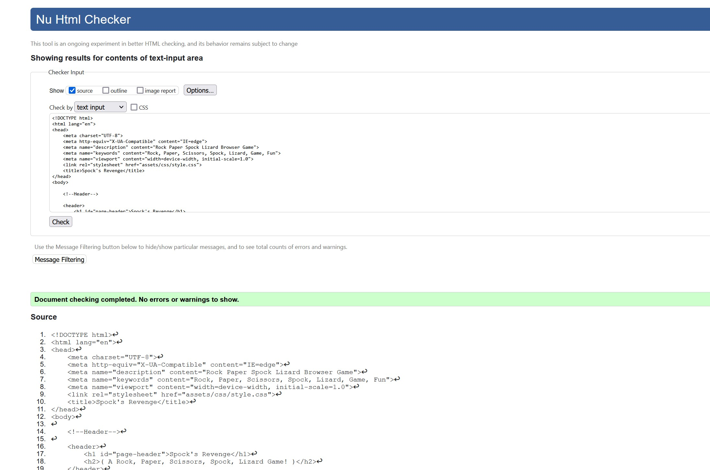
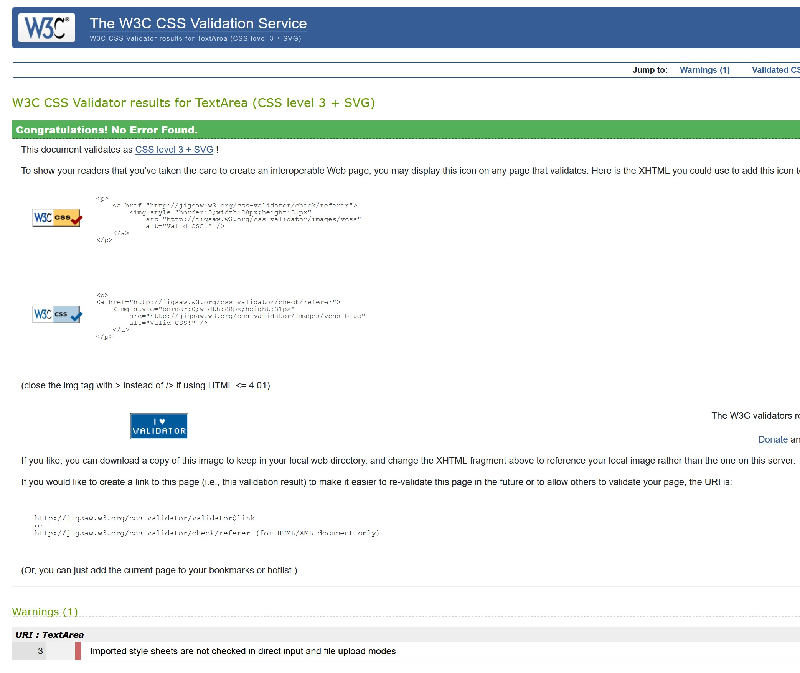
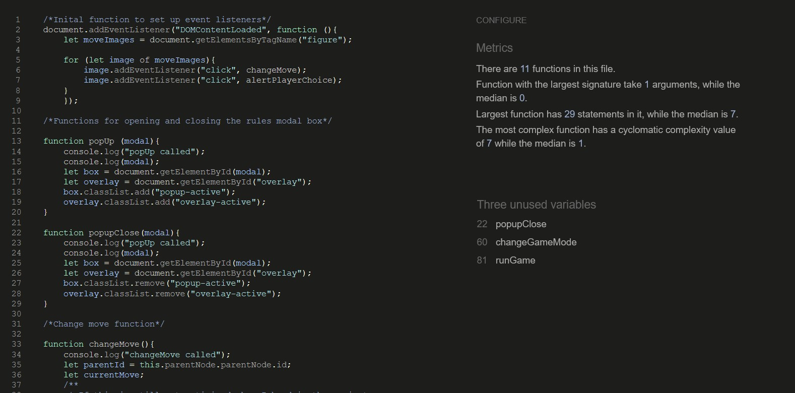

# Spock's Revenge: A Rock Paper Scissors Spock Lizard Game
Here is a link to the [live site.](https://javascriptjacksn.github.io/project-two-interactive-frontend-rock-paper-scissors-spock-lizard/)

## Concept
Spock’s Revenge is a browser game inspired by the project idea given by the Code Institute as part of my portfolio project two assessment.
The concept of the game is simple, where the original childhood game of Rock Paper Scissors has the addition of Spock and Lizard as moves, giving each move victory over two other possible opponent moves, rather than one like the original game.

In addition to this concept to work with, Spock’s Revenge gains the additional game mode to play against another player, as well as the computer. This aims to increase the user experience to include a potential human opponent as users want.
## Features
### Existing Features
- Header
    - The header clearly displays the game’s name in bold font for users to see.
    - The header also displays a smaller heading that is a description to users of what this game is in practice, rather than the catchy name above it.
    - This ensures users know immediately upon entering the site that Spock’s Revenge is a Rock Paper Scissors Lizard Spock game.
- The Rules
    - The Rules are displayed via a modal window that pops up using javascript.
    - The button itself is noticeable and easy to access, displaying the rules for the user when the modal is opened.
    - The rules clearly state the specific player versus player rules that rely on user trust. This was inspired by the Love Maths walkthrough project, which similarly relied on users not cheating.
    - The rules also show the user the different means of victory for each move combination.
    - To ensure the players can read the rules before starting, the rules modal pops up automatically at the selection of a new game mode, which must occur before the game is started.

    

- The Game Modes
    - Spock’s Revenge has two buttons to select each game mode; player versus player and player versus computer.
    - If the user does not select a game mode before running the game, they will be prompted to select one before the game starts, which as noted above then automatically displays the rules to the user.
    - Once a game mode has been selected, the DOM is updated to show the selected game mode as well as giving users feedback in the form of a browser alert to their newly selected game mode.
    - This increases the benefits to user experience, ensuring all users are aware of the rules and expect the game to run with the correct game mode, which it does successfully.
- Changing Moves
    - The game has an intuitive and user-friendly change move modal pop-up window that clearly shows each move that can be selected.
    - Each player has their own box, allowing for the DOM to be correctly read and updated to the player’s choice.
    - Once a move is successfully selected, the user will get an alert as feedback so they know which move they selected successfully.
    - This was done with alerts, as it is a simple and effective way to not permanently keep the player’s chosen move visible to the other player if playing the PVP (player versus player) game mode.

    

- The Game Results
    - Once the user clicks the ‘Play’ button, a simple check is made to ensure a valid game mode has been chosen, if not, it will prompt the user to select one.
    - If the game mode is PVC (player versus computer), it will generate a random move for player 2.
    - The game will check the combination of moves against a nested array data structure and from this will determine the winner.
    - From this data structure, the victory message and score counters will be displayed/updated.
    - At this time, the moves chosen appear parallel to each other, on either side of the ‘VS’ background image shortly before a timed delay produces the winning message and player in a modal popup box.
    - After this, the game resets, retaining the same game mode for user experience, so as to not go through the process of selecting a new game mode each time playing for game momentum to continue.

    

### Features Left to Implement
- Potentially, a feature that allowed users to enter their own names to be displayed.
- I would have also potentially furthered this by adding a high-score system for users that saved their scores and names to a database or external file.
## Testing
- The game was tested on the browsers listed below:
    - Chrome
    - Firefox
    - Safari (mobile only)
    - DuckDuckGo (mobile only)
- The game was also tested on the hardware devices listed below:
    - iPhone XR
    - iPhone 12
    - iPhone 6s
    - MSI laptop 15” display
    - Surface Pro 4 12.3” display
    - Asus TUF curved monitor 31.5” display
- On all devices listed above, the site is fully responsive and accessible.
- Firefox and Chrome dev tools were also used to simulate the realistic viewports of a varied selection of devices, to which all are currently responsive and accessible.
- I confirmed that the colors and fonts chosen are easy to read and accessible by running the site through Chrome’s lighthouse in the developer tools.
- Three user candidates were asked to use and test the site before and post-deployment, with their user experience stories really being of use in bug fixing as explained in the 'Bugs' section.

- HTML Validation returned no errors or warnings

- CSS validation returned no errors, only one warning regarding the validation of the google fonts import link.

- JavaScript validation returned no errors, only three warnings regarding unused variables which were names of functions that were called via HTML ‘onclick’ attributes rather than in the script itself.

## Bugs
### Solved Bugs
- It was discovered that if the devices were multitasking or used fairly old hardware, the background video would take an unsatisfactory time to load.
    - To solve this, a poster was added to the image post-deployment to ensure a backup screenshot of the video was displayed if the video took to long to load.
    - Whilst not a bug fix and more of an optimisation, after further testing this was observed to make the greatest improvement to older hardware such as an iPhone 6s.
- The audio file was not being located properly in GitHub pages by the JavaScript.
    - This was an issue with the file path being absolute, which worked in the live server preview but not GitHub pages.
### Unsolved Bugs
- At the top of the header, on some device viewports, the background color of a mid-opacity gray does not extend to the top of the page and leaves a bar of the background video.
- The victory audio on first playthrough may be desynced if it takes too long to load.
    - This is solved in some cases as I moved the code further to the start of the runGame function to allow for a buffer of time for the audio to load.
    - If this occours, on the next playthrough it will run as expected and synced.
- Whilst not a bug in the technical sense, it is possible for users to be able to run the game without chaning moves first.
    - This missing feature aroused after building the game around the best practises of having no global variables.
    - There are fixes to this I would like to implement, however it regretably would take a re-work of major features and could potentially result in global variables being created.
    - In an attempt to remedy this, users are prompted to change moves at the stages of the game where it is required (at the start of each round) and only both players are prompted if the game mode is player versus player.
    - Whilst this will ensure almost all users have a good user experience and time playing the game, some users who ignore the prompts intentionally or unintentionally, will play a round with moves they didn't chose, or moves saved to the DOM from the previous round.
    - Through post-deployment testing, it was observed that no users encountered this issue, and when it was explained to them and they were asked how much it effected their expereince, the candidates testing the game all agreed it was a minor issue that they would not have discovered if it was not pointed out to them. 
## Deployment
- The project was deployed to GitHub Pages using the following steps…
    1. Log in to GitHub and locate the Project Two Interactive Frontend Repository.
    2. At the top of the Repository (not the top of the page), locate the "Settings" button on the menu.
    3. Scroll down the Settings page until you locate the "GitHub Pages" Section.
    4. Under "Source", click the dropdown called "None" and select "Master Branch".
    5. The page will automatically refresh.
    6. Scroll back down through the page to locate the now published [site link](https://javascriptjacksn.github.io/) in the "GitHub Pages" section.
## Credits
### Content
- The Orbitron font was imported from [Google Fonts](https://fonts.google.com/)
- The Javascript for the victory audio was taken and edited from this [Stack Overflow post.](https://stackoverflow.com/questions/9419263/how-to-play-audio) 
### Media
- All move icons were from [Free Icons Library](https://icon-library.com/icon/spock-icon-3.html)
- The background video was trimmed down from the YouTube channel [ZEFilms Productions](https://www.youtube.com/watch?v=nBGWz9Oiwg0)
